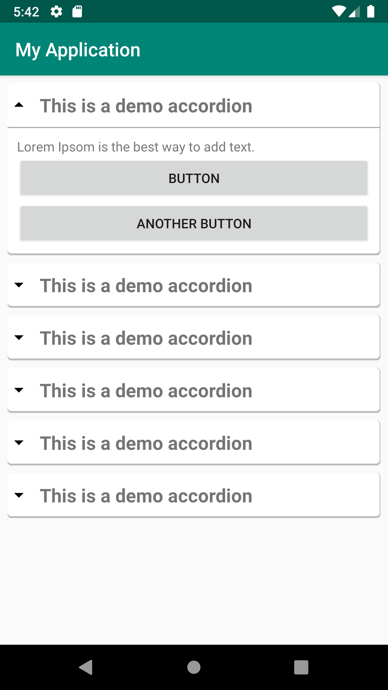

<!--
*** Thanks for checking out this README Template. If you have a suggestion that would
*** make this better, please fork the repo and create a pull request or simply open
*** an issue with the tag "enhancement".
*** Thanks again! Now go create something AMAZING! :D
-->


<!-- PROJECT SHIELDS -->
<!--
*** I'm using markdown "reference style" links for readability.
*** Reference links are enclosed in brackets [ ] instead of parentheses ( ).
*** See the bottom of this document for the declaration of the reference variables
*** for contributors-url, forks-url, etc. This is an optional, concise syntax you may use.
*** https://www.markdownguide.org/basic-syntax/#reference-style-links
-->
[](https://jitpack.io/#sh-sabbir/AccordionView)
[![Contributors][contributors-shield]][contributors-url]
[![Forks][forks-shield]][forks-url]
[![Stargazers][stars-shield]][stars-url]
[![Issues][issues-shield]][issues-url]
[![MIT License][license-shield]][license-url]
[![LinkedIn][linkedin-shield]][linkedin-url]


<!-- PROJECT LOGO -->
<br />
<p align="center">
  <a href="https://github.com/sh-sabbir/AccordionView">
    
  </a>

  <h3 align="center">AccordionView</h3>

  <p align="center">
    An awesome AccordionLayout for your android projects!
    <br />
    <a href="https://github.com/sh-sabbir/AccordionView"><strong>Explore the docs »</strong></a>
    <br />
    <br />
    <a href="https://github.com/sh-sabbir/AccordionView">View Demo</a>
    ·
    <a href="https://github.com/sh-sabbir/AccordionView/issues">Report Bug</a>
    ·
    <a href="https://github.com/sh-sabbir/AccordionView/issues">Request Feature</a>
  </p>
</p>


<!-- TABLE OF CONTENTS -->
## Table of Contents

* [About the Project](#about-the-project)
  * [Built With](#built-with)
* [Getting Started](#getting-started)
  * [Prerequisites](#prerequisites)
  * [Installation](#installation)
* [Usage](#usage)
* [Contributing](#contributing)
* [License](#license)
* [Contact](#contact)
* [Acknowledgements](#acknowledgements)


<!-- ABOUT THE PROJECT -->
## About The Project[&#8593;](#table-of-contents)



I was personally looking for a good AccordionView for one of my projects. Surprisingly there is no default one also no perfect thirdpary library! So decided to create one for myself and share with the universe to distribute joy :wink:

Here is why you should use:
* You have many critical things to do than creating a custom view.
* You need freedom
* You are just a lazy like me :roll_eyes:


### Built With[&#8593;](#table-of-contents)
* [Android Studio](https://developer.android.com/studio)


<!-- GETTING STARTED -->
## Getting Started[&#8593;](#table-of-contents)

All you have to do is to add this library to your project and start using as per the [examples!](#usage)

### Prerequisites[&#8593;](#table-of-contents)

This is just a Library. You must have an existing project to use it.


### Installation[&#8593;](#table-of-contents)

#### Gradle[&#8593;](#table-of-contents)
1. Add the JitPack repository to your build file
```sh
allprojects {
	repositories {
		...
		maven { url 'https://jitpack.io' }
	}
}
```
2. Add the dependency
```sh
dependencies {
	implementation 'com.github.sh-sabbir:AccordionView:0.1.0'
}
```
3. Sync Project

#### Maven[&#8593;](#table-of-contents)
1. Add the JitPack repository to your build file
```sh
<repositories>
    <repository>
	<id>jitpack.io</id>
        <url>https://jitpack.io</url>
    </repository>
</repositories>
```
2. Add the dependency
```sh
<dependency>
    <groupId>com.github.sh-sabbir</groupId>
    <artifactId>AccordionView</artifactId>
    <version>0.1.0</version>
</dependency>
```
3. Sync Project


<!-- USAGE EXAMPLES -->
## Usage[&#8593;](#table-of-contents)

Use this space to show useful examples of how a project can be used. Additional screenshots, code examples and demos work well in this space. You may also link to more resources.

The accordion component can also be generated from the java class 
```sh
AccordionView accordionView = new AccordionView(this);
```

The best way to use this component is from the layout xml file. The following example with llustrate the use:

```sh
<dev.iamsabbir.accordionview.AccordionView
	android:layout_width="match_parent"
	android:layout_height="wrap_content"
	android:layout_alignParentStart="true"
	android:visibility="visible"
	app:isAnimated="false"
	app:heading="This is a demo accordion"
	app:isExpanded="true"
	app:isPartitioned="true">

	<TextView
	    android:id="@+id/textView"
	    android:layout_width="match_parent"
	    android:layout_height="wrap_content"
	    android:text="Lorem Ipsom is the best way to add text." />

	<Button
	    android:layout_width="match_parent"
	    android:layout_height="wrap_content"
	    android:text="Button"
	    android:id="@+id/button_2"
	    android:layout_below="@+id/textView" />
	<Button
	    android:layout_width="match_parent"
	    android:layout_height="wrap_content"
	    android:text="Another Button"
	    android:layout_below="@+id/button_2" />

</dev.iamsabbir.accordionview.AccordionView>
```

The accordion component has two parts. 
1. Heading: the top part of the accordion, 'This is a demo accordion' in the above example. 
2. The body, that I call 'paragraph'. This body is a RelativeLayout and would contain what ever UI elements you add to the accordion. 

You would see that there are several new attributes I have defined for the accordion. 
#### 1. Heading 
```
app:heading="This is a demo accordion"
```
 or
```
accordionView.setHeadingString("Oh my heading");
```
This defines the string to be used as heading. 
  
#### 2. Partition (boolean): the 'line' between the heading and the paragraph. 
```
app:isPartitioned="true"
```
 or
```
accordionView.setPartitioned(true);
```
This  value determines if the line is drawn between the heading and the paragraph. 
  
#### 3. Expanded (boolean): this value determines if the paragraph is expanded by default. 
```app:isExpanded="true"```
 or
```
accordionView.setExpanded(true);
```
  
#### 4. Animated (boolean): this value determines if the accordion expands or collapses with an animation
```
app:isAnimated="true"
```
 or
```
accordionView.setAnimated(true);
```
The accordion view above is an AccordionView object that can be created as (in an Activity):
```
AccordionView wordView = new AccordionView(this);
```
  
#### 5. Heading Background: this value determines the color/drawable to be used for the background
      
```
app:headingBackground = "@drawable/example_layout_drawable" (to use a drawable)
app:headingBackgroundColor = "@android:color/white" (to set just the color)
```
 or
```        
accordionView.setHeadingBackground(R.drawable.custom_background);    (to use a drawable)
accordionView.setHeadingBackgroundColor(Color.WHITE);    (to set just the color)
```
        
#### 6. Body/Paragraph Background: this value determines the color/drawable to be used for the body of the accordion
```
app:bodyBackground="@drawable/custom_drawable" (to set the drawable)
app:bodyBackgroundColor="#233245" (to set the color)
```
 or
```
accordionView.setBodyBackground(R.drawable.custom_drawable);    (to set just the color)
accordionView.setBodyBackgroundColor(Color.CYAN);    (to set just the color)
```

To add different elements into the body (paragraph) of the accordion component, you can simply define them within the AccordionView tag. 

You can also add a listener to be triggered when the accordion is expanded or collapsed
```
accordionView.setOnExpandCollapseListener(new AccordionExpansionCollapseListener() {
	    @Override
	    public void onExpanded(AccordionView view) {
		//your code here
	    }

	    @Override
	    public void onCollapsed(AccordionView view) {
	       //you code here
	    }
 });
``` 
	 
	 
<!-- CONTRIBUTING -->
## Contributing[&#8593;](#table-of-contents)

Contributions are what make the open source community such an amazing place to be learn, inspire, and create. Any contributions you make are **greatly appreciated**.

1. Fork the Project
2. Create your Feature Branch (`git checkout -b feature/AmazingFeature`)
3. Commit your Changes (`git commit -m 'Add some AmazingFeature'`)
4. Push to the Branch (`git push origin feature/AmazingFeature`)
5. Open a Pull Request


<!-- LICENSE -->
## License[&#8593;](#table-of-contents)

Distributed under the MIT License. See `LICENSE` for more information.


<!-- CONTACT -->
## Contact[&#8593;](#table-of-contents)

Sabbir Hasan - sabbirshouvo@gmail.com

Project Link: [https://github.com/sh-sabbir/AccordionView](https://github.com/sh-sabbir/AccordionView)


<!-- ACKNOWLEDGEMENTS -->
## Acknowledgements[&#8593;](#table-of-contents)
* [GitHub Emoji Cheat Sheet](https://www.webpagefx.com/tools/emoji-cheat-sheet)
* [Img Shields](https://shields.io)
* [Choose an Open Source License](https://choosealicense.com)


<!-- MARKDOWN LINKS & IMAGES -->
<!-- https://www.markdownguide.org/basic-syntax/#reference-style-links -->
[contributors-shield]: https://img.shields.io/github/contributors/sh-sabbir/AccordionView.svg?style=flat
[contributors-url]: https://github.com/sh-sabbir/AccordionView/graphs/contributors
[forks-shield]: https://img.shields.io/github/forks/sh-sabbir/AccordionView.svg?style=flat
[forks-url]: https://github.com/sh-sabbir/AccordionView/network/members
[stars-shield]: https://img.shields.io/github/stars/sh-sabbir/AccordionView.svg?style=flat
[stars-url]: https://github.com/sh-sabbir/AccordionView/stargazers
[issues-shield]: https://img.shields.io/github/issues/sh-sabbir/AccordionView.svg?style=flat
[issues-url]: https://github.com/sh-sabbir/AccordionView/issues
[license-shield]: https://img.shields.io/github/license/sh-sabbir/AccordionView.svg?style=flat
[license-url]: https://github.com/sh-sabbir/AccordionView/blob/master/LICENSE.txt
[linkedin-shield]: https://img.shields.io/badge/-LinkedIn-black.svg?style=flat&logo=linkedin&colorB=555
[linkedin-url]: https://linkedin.com/in/sabbirshouvo
[product-screenshot]: images/Screenshot_accordionView.png
